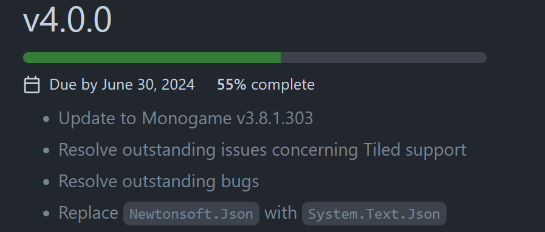

Hi everyone,

I wanted to take a moment and give a report on some of the progress made so far in getting version 4.0 officially released.

<!-- trunicated -->

## Current Status
If you take a look at the [v4.0.0 Milestone](https://github.com/craftworkgames/MonoGame.Extended/milestone/8) page, you can see we are now at 55% completed

If you'd like to checkout the list of issues that have been worked through so far, you can view them [here](https://github.com/craftworkgames/MonoGame.Extended/issues?q=is%3Aissue%20is%3Aclosed%20project%3Acraftworkgames%2F6).

A lot of the remaining issues here could be closed with better documentation, which is going to come in the last leg of this sprint. However, with the current pace, the current deadline of end of June is looking good.  If you'd like to get involved in helping resolve the backlog of issues, please do. Be sure to checkout the [Contributing Guidelines](https://github.com/craftworkgames/MonoGame.Extended/blob/develop/CONTRIBUTING.md) and fee free to contact me on discord with any questions.

And with that status report out of the way, I wanted to touch on some other subjects

## Repository Changes
**MonoGame.Extended** is an extension of **MonoGame**.  With this thought in mind, I have begun to restructure the project some, as many may have already noticed.  The reason behind this is that I feel things in Monogame.Extended should be placed in logical places that match types they are working with in MonoGame.  This keeps the source code structure similar to MonoGame which is beneficial for users working from source between both projects.  

What do I mean by this though?  Well, one example is the `RectangleExtensions`.  Previously it was placed in `MonoGame.Extended.Math`  However `Rectangle` in MonoGame exits in the root namespace, not in a `Math` namespace.  So `RectangleExtensions` will be moved to the project root to match the similar structure.  Some other changes, like `TextureRegion2D` is currently located in the `MonoGame.Extended.TextureAtlases` directory/namespace. At first, this seems like a logical fit, but a `TextureRegion2D` is a region of a `Texture2D`.  Atlases just use them, you don't have to have an atlas to use a `TextureRegion2D`.  So because they are more locally related to the `Texture2D` in MonoGame, they will be moved to a similar directory/namespace (`MonoGame.Extended.Graphic`).

## In Conclusion
I know no one like change, and changes like this may seem superfluous, but I do believe it will be a better user experience moving forward with 4.0.  However, I do value community feedback, so please give me your thoughts and feedback on this in the comment section at the end of this document.  We're halfway there to the 4.0.0 release.

