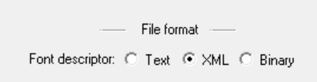

BMFont support has had a small update in MonoGame.Extended.

<!-- trunicated -->

Previously, MonoGame.Extended required that the `.fnt` file created by BMFont be exported as XML. However, BMFont offers two other export formats, Text and Binary, both of which were not supported.  

With [PR #887](https://github.com/craftworkgames/MonoGame.Extended/pull/887) all three export formats are now supported both when loading the file directly at runtime or if you want to use the Content Pipeline to preprocess the file.

This change is significant because it means that you can use any tool that can export a `.fnt` file in the AngleCode Bitmap Font file format, such as [libGDX Hiero](https://libgdx.com/wiki/tools/hiero) which can be used cross platform.  Previously only the AngleCode BMFont application could be used, which was Windows only, unless you setup WINE on macOS or Linux to run it.

Another benefit of this is that Hiero supports exporting the fonts as Signed Distance Field, which means I can start implementing SDF Font Rendering support.

The [BitmapFont Feature](../../../docs/features/bitmap-font/bitmap-font.md) article has also been updated to better explain how to use the feature. 

That's all for now, hope everyone is having a great week.

\- Aris