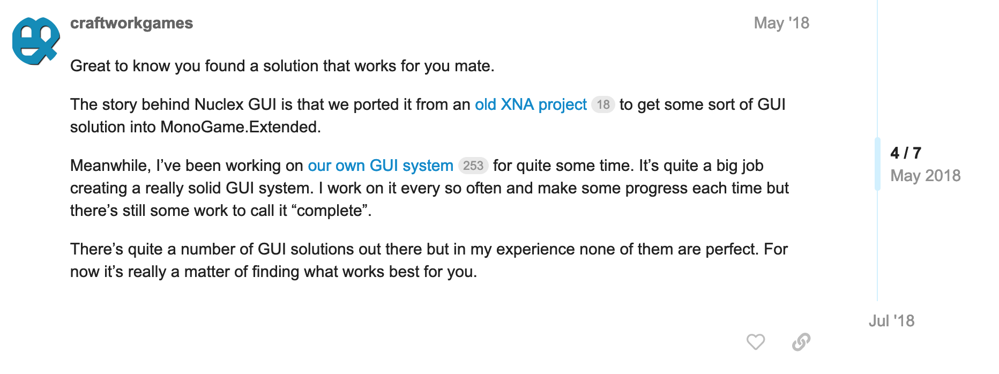

If you've been active in the MonoGame Discord or other community spaces lately, you might have heard of [GUM](https://docs.flatredball.com/gum). GUM is a game UI layout tool created by Victor Chelaru ([@vchelaru](https://github.com/vchelaru)) and is used in the engine he maintains, [FlatRedBall](https://flatredball.com/). Recently, it was updated to work as a standalone tool that can be used in any MonoGame project.

As I review the backlog of issues in MonoGame.Extended and prepare for the library's future, you can probably guess where this post is heading.

<!-- truncated -->

## MonoGame.Extended.GUI
Initially, a port of Nuclex GUI was made as a GUI solution in MonoGame.Extended. Following that, Dylan, the original creator and maintainer of MonoGame.Extended, began work on the current MonoGame.Extended.Gui library.

Dylan's original statement that **"It’s quite a big job creating a really solid GUI system."** is very true. Not only is it a big job to create one, but it's also a significant effort to maintain it, fix bugs, and add new features.

## Meet GUM
I've been keeping an eye on Vic's GUM Tool for a while now, and it's a solid tool. GUM consists of two parts: the GUM Layout Engine, which is the code framework, and the GUM Tool.

The GUM Tool is a WYSIWYG Editor where you can visually create the UI elements for your game.

You can export your creations from the editor to a format that can be loaded into MonoGame and used. Alternatively, if you prefer not to use the editor, **you don't have to**. GUM also supports a code-first approach to creating layouts and UI.

I highly recommend checking it out. Here's the [MonoGame Setup](https://docs.flatredball.com/gum/monogame/setup) documentation page for it.

## What Does This Mean?
As I look forward to the future of MonoGame.Extended, I need to determine how best to maintain and advance the library. To quote Dylan again, **"It’s quite a big job creating a really solid GUI system."** Vic has done this with GUM and done it well.

After discussing with Vic earlier today, I will begin working with him to integrate GUM into MonoGame.Extended, replacing the current MonoGame.Extended.Gui portion. This means that GUM will become the standard supported UI choice in MonoGame.Extended in the future.

## What About MonoGame.Extended.Gui?
*Deleted, gone*....

Just kidding. A lot of work has gone into MonoGame.Extended.Gui. From Dylan's initial efforts to the contributions from various contributors, I have great respect for the time and effort invested in it.

It’s a significant part of MonoGame.Extended’s history, and I wouldn't just discard the work that's been done. Some may still wish to use and contribute to it in the future.

Therefore, when the time comes, MonoGame.Extended.Gui will be moved out of the main MonoGame.Extended repository into its own separate project, where it can continue to exist and be used by those who prefer it.

## Let's Wrap This Up
In conclusion, the focus of the UI portion of MonoGame.Extended will shift to using GUM UI. The existing MonoGame.Extended.Gui project will be moved to its own repository, where it can be maintained separately.

If you have a moment, I encourage you to check out [GUM](https://docs.flatredball.com/gum). It truly is an amazing tool, and I look forward to its integration into the MonoGame.Extended ecosystem.

If you have any questions or concerns, please let me know in the comments below or on Discord. Have a great weekend, everyone.

\- Aris
