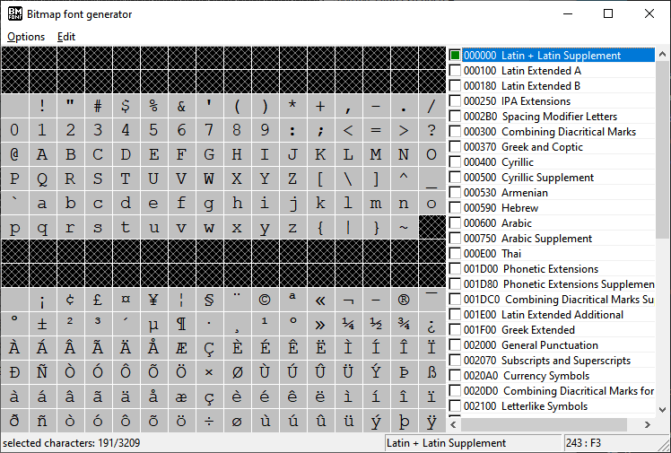
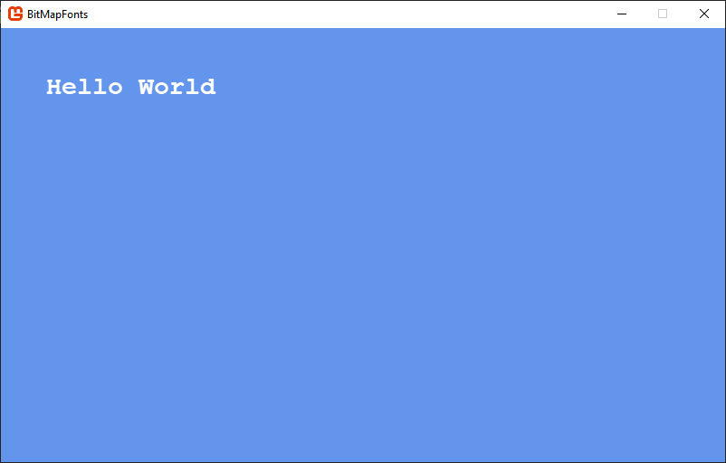

:::tip[Up to date]
This page is **up to date** for MonoGame.Extended `@mgeversion@`.  If you find outdated information, [please open an issue](https://github.com/craftworkgames/craftworkgames.github.io/issues).
:::

This is an overview of the `BitmapFont` feature in **MonoGame.Extended**.  `BitmapFonts` are font files (`.fnt`) created using the [AngelCode BMFont](https://www.angelcode.com/products/bmfont/) format. You can generate these files with tools like the [BMFont](https://www.angelcode.com/products/bmfont/) tool or alternatives such as [libGDX Hiero](https://libgdx.com/wiki/tools/hiero).

In this article, we'll explore why `BitmapFonts` are a great alternative to the built-in `SpriteFont` in MonoGame. Whether you're facing limitations with SpriteFont or seeking more control over your game fonts, `BitmapFonts` provide a robust solution.

We'll also dive into the `BitmapFont` class in MonoGame.Extended, designed to act as a drop-in replacement for the SpriteFont class. You'll learn how to take the `.fnt` files and associated textures generated by these tools and seamlessly load them into your game, just like any other content

## Installing BMFont
To generate the font files and associated textures, you'll need a tool that outputs in the AngelCode BMFont format. For this tutorial, we'll use the official AngelCode BMFont tool. Follow these steps to get started:

1. Open your browser and navigate to https://www.angelcode.com/products/bmfont/.
2. Click the download link for version **1.14a**, which includes both x86 and x64 assemblies.  This will download the **bmfont1.14a.zip** file.
3. Extract the contents of the downloaded zip file.

After extracting the contents of the zip file, you can run the BMFont tool by using either the **bmfont32.exe** or **bmfont64.exe** executable found in the extracted directory.

## The BMFont Main Window

When you first open BMFont, you'll see a screen similar to this:



This is the main window of BMFont, displaying all the characters of the font. You can click and drag over the characters to highlight or unhighlight them. Only the highlighted characters will be exported. Additionally, you can use the checkboxes on the right-hand side to select a full set from the font file, such as just the Latin characters..  

:::tip

Unless you need every character glyph from a font, it's recommended to highlight only the characters you'll use. This practice helps reduce the final texture size by exporting only the necessary characters.

:::

## Choosing A Font
To change the font you want to export, open the **Font Settings** dialog. You can do this by clicking **Options** and then **Font Settings** from the top menu, or by using the **F** keyboard shortcut.


In the **Font Settings** dialog, you can select the font you want to export, set the font size, and adjust various other settings. These adjustments will impact the texture file generated during the export process.

Once you've chosen your desired font and configured the settings, click the **OK** button at the bottom to close the **Font Settings** dialog.

## Choosing Export Settings
To adjust the export settings, open the **Export Options** dialog. You can do this by clicking **Options** and then **Export Settings** from the top menu, or by using the **T** keyboard shortcut.


In the **Export Options** dialog, you can adjust various settings related to the export. The key settings to focus on are **File Format**, **Texture**, **Bit Depth**, and the **Alpha**, **Red**, **Green**, and **Blue** channel settings.

- **Bit Depth**: It is recommended to set this to **32 bits**.
- **Textures**: Set this to **PNG**.
- **File Format**: Any of the available formats can be used, as MonoGame.Extended supports all three. The **Binary** format will produce a smaller file, but it is not human-readable like the XML or Text formats. Since manual editing of the file is typically unnecessary, using the Binary format is advisable.

For the **Alpha**, **Red**, **Green**, and **Blue** channel settings, it is recommended to use the **White text with alpha** option from the **Presets** drop-down.

You can experiment with different settings to see how they affect the output.

Once you have chosen your desired export settings, click the **OK** button at the bottom to close the **Export Options** dialog.

## Generating the Export

Once you have finished configuring the **Font Settings** and **Export Options**, highlight all the character glyphs you want to export by clicking on them from the main screen. After selecting the desired characters, you can preview the final texture output by clicking **Options** and then **Visualize** from the top menu, or by using the **V** keyboard shortcut.

Once you are satisfied with the output, generate the export by clicking **Options** and then **Save bitmap font as** from the top menu, or by using the **Ctrl+S** keyboard shortcut.

Saving the font will produce a `.fnt` file along with one or more texture files.

## Loading the `BitmapFont` in Your Game

Now that you have the `.fnt` file and textures generated, you can use them in your MonoGame project. You have two options for loading them:

1. Load them directly from file at runtime.
2. Use the MonoGame Content Pipeline to preprocess them and load them using the `ContentManager`.

Both methods are described in the sections below.

### Loading From File At Runtime
To load the `BitmapFont` at runtime, ensure that the `.fnt` file and the texture files associated with it are in the same directory. They must be in the same directory; otherwise, loading will fail when attempting to load the textures. Then you can load them using the `BitmapFont.FromFile` or `BitmapFont.FromStream` methods.

**From File Example**

```cs
BitmapFont bmfont = BitmapFont.FromFile("path/to/my-font.fnt");
```

**From Stream Example**
```cs
using(var stream = TitleContainer.OpenStream("Content/my-font.fnt"))
{
    BitmapFont bmfont = BitmapFont.FromStream(stream);
}
```

### Loading Using The Content Pipeline.
To load the `.fnt` files using the Content Pipeline, you first need to add the `MonoGame.Extended.Content.Pipeline.dll` reference to the **MGCB Editor**. If you have not done this yet, please reference the [Installation](/docs/getting-started/installation-monogame.mdx) article.

Once the reference is added, you can add the `.fnt` file and its associated textures to the **MGCB Editor**. If you are using directories inside the MGCB Editor to organize content, ensure that the textures for the .fnt file are placed in the same directory as the .fnt file.


Once the `.fnt` file and textures are added to the project, build the content project. After that, you can load the `BitmapFont` using the `ContentManager`.

```cs
BitmapFont bmfont = Content.Load<BitmapFont>("my-font");
```

## Rendering text in your game

**MonoGame.Extended** provides extension methods for the `SpriteBatch` that to allow you to easily render text in your game using the `BitmapFont` file after it's been loaded.

In your `Draw` method use the `DrawString` extension method to render text, much like you would with a traditional `SpriteFont`.

```csharp
_spriteBatch.Begin();
_spriteBatch.DrawString(bmfont, "Hello World", new Vector2(50, 50), Color.White);
_spriteBatch.End();
```


