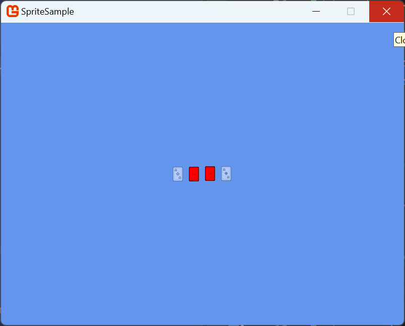

import PlayingCards from './cards.png'

## Overview

Using a `Texture2DAtlas` to create and manage our `Texture2DRegion`s is nice but sometimes we want a more concrete implementation of what we're drawing. Something that can encapsulate the common properties used when rendering such as scale, rotation, and color.  This is where the `Sprite` class comes in. At it's core, it holds a reference to a `Texture2DRegion` with adjustable properties to use when rendering that get applied automatically when drawing it.

## Usage
Let's take the cards image from the previous two examples and use them to create and render a sprite.

<figure>
    
    <figcaption>
        <small>
            <a href="https://kenney.nl/assets/playing-cards-pack">Playing Cards Pack</a> by <a href="https://www.kenney.nl">Kenney</a>; Licensed under CreativeCommons Zero, CC0
        </small>
    </figcaption>
</figure>

We'll start with the usual of loading the `Texture2D` and using that to create a `Texture2DAtlas` with a region that represents the Ace of Hearts card

```cs
// highlight-next-line
private Texture2DAtlas _atlas;
// highlight-next-line
private Sprite _aceOfHearts;

protected override void LoadContent()
{
    // highlight-next-line
    Texture2D cardsTexture = Content.Load<Texture2D>("cards");

    //  Create the atlas and add a region to it.
    // highlight-next-line
    _atlas = new Texture2DAtlas(cardsTexture);
    // highlight-next-line
    _atlas.CreateRegion(11, 68, 42, 60);
}
```

Now that we have the atlas created and the region representing our Ace of Hearts card added to it, we can tell the atlas to create a sprite instance for us based on this region

```cs
protected override void LoadContent()
{
    Texture2D cardsTexture = Content.Load<Texture2D>("cards");

    //  Create the atlas and add a region to it.
    _atlas = new Texture2DAtlas(cardsTexture);
    _atlas.CreateRegion(11, 68, 42, 60);

    //  Create a sprite from the atlas
    // highlight-next-line
    _aceOfHearts = _atlas.CreateSprite()
}
```

Then we can use the `SpriteBatch.Draw` extensions provided by MonoGame.Extended to draw the `Sprite` we created

```cs
protected override void Draw(GameTime gameTime)
{
    GraphicsDevice.Clear(Color.CornflowerBlue);

    // highlight-next-line
    _spriteBatch.Begin();
    // highlight-next-line
    _spriteBatch.Draw(_aceOfHearts, new Vector2(316, 270));
    // highlight-next-line
    _spriteBatch.End();

    base.Draw(gameTime);
}
```

Which gives us the following result

<figure><br/><figcaption><small>The result of rendering the `_aceOfHearts` sprite from the example above.</small></figcaption></figure>


Doing it like this though is not much different than just using a `Texture2DRegion` unless we make use of the `Sprite` properties.

### Sprite Properties
The `Sprite` class has the following properties that can be set

| Property    | Type                                             | Description                                                               |
| ----------- | ------------------------------------------------ | ------------------------------------------------------------------------- |
| `IsVisible` | `bool`                                           | Gets or Sets a value that indicates whether the sprite should be rendered |
| `Color`     | `Microsoft.Xna.Framework.Color`                  | Gets or Sets the color mask to apply when rendering the sprite.           |
| `Alpha`     | `float`                                          | Gets or Sets the alpha transparency value used when rendering the sprite. |
| `Depth`     | `float`                                          | Gets or Sets the layer depth used when rendering the sprite.              |
| `Effect`    | `Microsoft.Xna.Framework.Graphics.SpriteEffects` | Gets of Sets the sprite effect to apply when rendering.                   |

As an example, let's create `Sprite`s for the other Ace cards and adjust some of their properties to show the affect.  Adjust your code to the following

```cs
// highlight-next-line
private Texture2DAtlas _atlas;
// highlight-next-line
private Sprite _aceOfHearts;
// highlight-next-line
private Sprite _aceOfDiamonds;
// highlight-next-line
private Sprite _aceOfClubs;
// highlight-next-line
private Sprite _aceOfSpades;

protected override void LoadContent()
{
    _spriteBatch = new SpriteBatch(GraphicsDevice);

    Texture2D cardsTexture = Content.Load<Texture2D>("cards");

    //  Create the atlas and add regions to it for each ace card
    _atlas = new Texture2DAtlas(cardsTexture);
    // highlight-next-line
    _atlas.CreateRegion(11, 68, 42, 60, "Ace of Hearts");
    // highlight-next-line
    _atlas.CreateRegion(11, 68, 42, 60, "Ace of Diamonds");
    // highlight-next-line
    _atlas.CreateRegion(11, 133, 42, 60, "Ace of Clubs");
    // highlight-next-line
    _atlas.CreateRegion(11, 198, 42, 60, "Ace of Spades");


    //  Create a sprite from the atlas
    // highlight-next-line
    _aceOfHearts = _atlas.CreateSprite("Ace of Hearts");
    // highlight-next-line
    _aceOfDiamonds = _atlas.CreateSprite("Ace of Diamonds");
    // highlight-next-line
    _aceOfClubs = _atlas.CreateSprite("Ace of Clubs");
    // highlight-next-line
    _aceOfSpades = _atlas.CreateSprite("Ace of Spades");

    //  Change the color mask of the heart and diamond to red
    // highlight-next-line
    _aceOfHearts.Color = Color.Red;
    // highlight-next-line
    _aceOfDiamonds.Color = Color.Red;

    //  Change the Alpha transparency of the club and spade to half
    // highlight-next-line
    _aceOfClubs.Alpha = 0.5f;
    // highlight-next-line
    _aceOfSpades.Alpha = 0.5f;
}

protected override void Draw(GameTime gameTime)
{
    GraphicsDevice.Clear(Color.CornflowerBlue);

    _spriteBatch.Begin();
    _spriteBatch.Draw(_aceOfHearts, new Vector2(316, 270));
    // highlight-next-line
    _spriteBatch.Draw(_aceOfDiamonds, new Vector2(358, 270));
    // highlight-next-line
    _spriteBatch.Draw(_aceOfClubs, new Vector2(400, 270));
    // highlight-next-line
    _spriteBatch.Draw(_aceOfSpades, new Vector2(442, 270));
    _spriteBatch.End();

    base.Draw(gameTime);
}
```

When you run the example now, you can see that the Red color mask is automatically applied for Ace of Hearts and Diamonds, and the alpha transparency is automatically applied for the Ace of Clubs and Spades.

<figure><br/><figcaption><small>The result of rendering the ace cards as `Sprite` classes with adjusted properties from the example above.</small></figcaption></figure>

## Conclusion
By creating `Sprite`s from the regions created in a `Texture2DAtlas`, we have a concrete implementation of the image we want to render.  This implementation features properties we can adjust that automatically get applied when its rendered.  