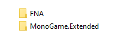

:::tip[Up to date]
This page is **up to date** for MonoGame.Extended `@mgeversion@`.  If you find outdated information, [please open an issue](https://github.com/craftworkgames/craftworkgames.github.io/issues).
:::

The following article details the steps necessary to get **MonoGame.Extended** installed and setup in your **FNA** project.  **MonoGame.Extended** can be used with either [**MonoGame**](https://github.com/monogame/monogame), [**KNI**](https://github.com/kniEngine/kni), or [**FNA**](https://github.com/FNA-XNA/FNA).  This article wil detail how to setup and install **MonoGame.Extended** with an existing **FNA** project.

:::note
- If you are using MonoGame, please see the [Installation (MonoGame)](./installation-monogame.mdx) document. 
- If you are using KNI, please see the [Installation (KNI)](./installation-kni.md) document.
:::

## Prerequisites
The following prerequisites are required when using **MonoGame.Extended** with **FNA**.

- Ensure your development environment is setup for **FNA** Development.
  - [Windows Setup](https://fna-xna.github.io/docs/1%3A-Setting-Up-FNA/#chapter-1b-windows-setup)
  - [Linux Setup](https://fna-xna.github.io/docs/1%3A-Setting-Up-FNA/#chapter-1a-linux-setup)

- An **FNA** project
  - [Chapter 5: Creating New Projects](https://fna-xna.github.io/docs/1%3A-Setting-Up-FNA/#chapter-5-creating-new-projects)

## Installation
To use **MonoGame.Extended** with **FNA**, you will need to clone the **MonoGame.Extended** repository locally  By default, **MonoGame.Extended** expects to be in the same directory that you have the FNA source repository cloned too

Once you have the source repos cloned, added a reference to the `/source/MonoGame.Extended/FNA.Extended.csproj` project file in your game project.

:::tip
The requirement for **FNA** and **MonoGame.Extended** cloned repositories being sibling directories is only the default setup.  If you would like to adjust this, you can adjust the **FNA** project reference path in the `/source/MonoGame.Extended/FNA.Extended.csproj` file.
:::

## Conclusion
Setting up **MonoGame.Extended** with an existing **FNA** project is straight forward and only requires that you clone the source and setup the directories correctly so that the project references can resolve.  Once added, you can immediately start taking advantage of what **MonoGame.Extended** has to offer.